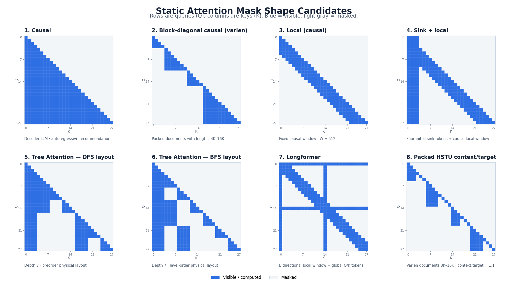
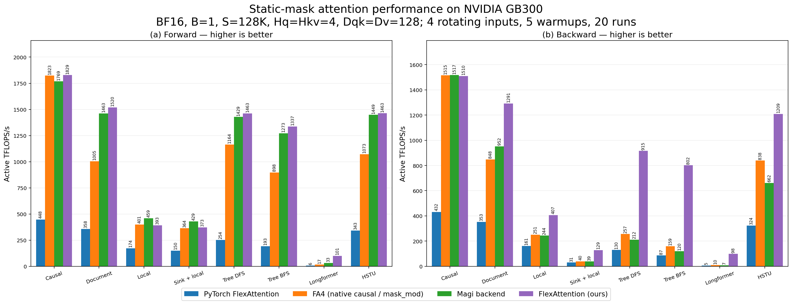

# Flex Attention

FlexAttention provides high-performance arbitrary-mask attention through interval mask plans
and packed predicate masks.

## Supported Configurations

- GPUs: SM90, SM100, and SM103.
- Layouts: fixed-length BSHD and true-variable-length THD.
- Data types: FP16 and BF16.
- Modes: forward, backward, MHA, GQA, and MQA.
- Head dimensions: the SM100/SM103 generic kernels independently support `Dqk` and `Dv`
  from `{8,16,...,128}`; `(192,128)` is also supported, while `(256,256)` uses a dedicated
  kernel.
- Masks: unions of intervals in the form `[0,F0), [F1,F2), [F3,F4), ...`.

Paged KV, SplitKV, MLA, FP8, SM80, and SM120 paths are not currently supported.

## Installation

```bash
python -m pip install -e '.[dev]'
```

The project requires `nvidia-cutlass-dsl>=4.5.2` and pins `quack-kernels==0.5.0`.
Release compatibility is validated with NVIDIA CuTe DSL 4.7.0.

## API

```python
from flex_attn import create_mask_plan, flex_attn_func

# q: [B, Sq, Hq, Dqk]
# k: [B, Sk, Hkv, Dqk]
# v: [B, Sk, Hkv, Dv]
# mask_func: contiguous CUDA int32 [Hmask, nfunc, B * Sq]
plan = create_mask_plan(mask_func, q, k, v)
out, lse = flex_attn_func(q, k, v, mask_plan=plan, return_lse=True)
```

Each `mask_func` endpoint uses sample-local K coordinates. The public tensor does not require
planner padding. After construction, `MaskPlan` does not retain `mask_func`; for variable-length
inputs, it owns copies of the sequence-prefix tensors.

With `return_lse=False`, the API returns `out`. With `return_lse=True`, it returns `(out, lse)`.

Variable-length geometry is provided only when constructing the plan:

```python
from flex_attn import create_mask_plan, flex_attn_varlen_func

plan = create_mask_plan(
    mask_func,
    q,
    k,
    v,
    cu_seqlens_q=cu_seqlens_q,
    cu_seqlens_k=cu_seqlens_k,
    max_seqlen_q=max_seqlen_q,
    max_seqlen_k=max_seqlen_k,
)
out, lse = flex_attn_varlen_func(q, k, v, mask_plan=plan, return_lse=True)
```

## Design Documentation

- [Arbitrary Mask Design (English)](docs/design.md)
- [Arbitrary Mask Design (Simplified Chinese)](docs/design_zh.md)

## Testing

```bash
PYTHONPATH=src:. python -m pytest tests/unit
PYTHONPATH=src:. python -m pytest tests/gpu --run-gpu
PYTHONPATH=src:. python -m pytest tests/gpu --run-gpu --full-random-cases
```

The default GPU smoke suite contains the original 144 randomly stratified representatives plus
10 directed SM100 head-dimension cases, for a total of 154 cases. `--full-random-cases` runs all
1,024 cases generated with the fixed seed.

## Standard Static-Mask Benchmark



The figure is schematic; the benchmark generator, rather than the illustrative token counts in
the image, defines the measured cases. The deterministic generators are defined in
[benchmark_flex_attn.py](benchmarks/benchmark_flex_attn.py): document lengths are 4K--16K;
tree attention has depth 7 and node-length jitter of 20%; Longformer uses radius 256 and eight
global tokens; each HSTU document is 8K--16K and is split evenly between context and target.

All values are medians on NVIDIA GB300 (SM103) with BF16, B=1, S=128K, Hq=Hkv=4, and
Dqk=Dv=128. FlexAttention uses the current generic SM100/SM103 default. Each backend rotates
four independently allocated Q/K/V/dO input sets, uses 5 warmups and 20 measured runs, and does
not run an explicit L2-flush kernel or sleep between samples. FA4 uses native `causal=True` for
the Causal case and `mask_mod` with the official Torch BlockMask training metadata path for the
other masks at
[commit 0251105a](https://github.com/dao-ailab/flash-attention/commit/0251105a2fb19d2957484b7f023cd8c115286ced).
Magi uses its CUDA Q2K/K2Q CSR planner and arbitrary-mask backend at
[commit 55221a93](https://github.com/jiayus-nvidia/flash-attention/commit/55221a93a8fc415a721502ed68643983dbf67862).

All four backends were rerun with the same mask generators, input seeds, input-pool order, and
timing protocol. FlexAttention, Magi, and PyTorch use CUTLASS DSL 4.5.2 and Quack 0.5.0. FA4
uses its declared CUTLASS DSL 4.6.2 and Quack 0.6.3 environment. The isolated processes ran on
the same physical GPU and the same source-tree fingerprint.

Forward and backward timings exclude metadata. For backward, four independent autograd graphs
are built outside the timed region before each four-sample round. TFLOPS use actual visible
attention pairs. Table speedup is baseline time divided by FlexAttention time, so values above
1.0x favor FlexAttention.

Correctness passed for all eight masks. O, LSE, dQ, dK, and dV were checked against a chunked
eager-FP32 reference at S=8K, followed by a full-S=128K cross-backend check. FA4 native causal
passed both checks in the official FA4 environment.

### Performance Comparison



Both panels report active TFLOPS/s and use the same medians as the tables below.

### Forward

| Mask | Flex ms / TFLOPS | FA4 ms / Flex speedup | Magi ms / Flex speedup | Torch ms / Flex speedup |
|---|---:|---:|---:|---:|
| Causal | 9.620 / 1828.8 | 9.650 / 1.00x | 9.945 / 1.03x | 39.249 / 4.08x |
| Varlen document causal | 0.967 / 1520.1 | 1.463 / 1.51x | 1.005 / 1.04x | 4.110 / 4.25x |
| Causal local W=512 | 0.350 / 392.7 | 0.343 / 0.98x | 0.299 / 0.86x | 0.792 / 2.26x |
| Sink S=4 + local W=512 | 0.371 / 372.9 | 0.380 / 1.02x | 0.323 / 0.87x | 0.921 / 2.48x |
| Tree attention DFS | 1.041 / 1462.6 | 1.308 / 1.26x | 1.066 / 1.02x | 6.008 / 5.77x |
| Tree attention BFS | 1.139 / 1337.1 | 1.696 / 1.49x | 1.197 / 1.05x | 7.889 / 6.93x |
| Longformer | 1.411 / 100.5 | 8.223 / 5.83x | 4.268 / 3.02x | 22.183 / 15.72x |
| Packed HSTU context/target | 0.868 / 1463.1 | 1.184 / 1.36x | 0.877 / 1.01x | 3.708 / 4.27x |

### Backward

| Mask | Flex ms / TFLOPS | FA4 ms / Flex speedup | Magi ms / Flex speedup | Torch ms / Flex speedup |
|---|---:|---:|---:|---:|
| Causal | 29.133 / 1509.6 | 29.030 / 1.00x | 28.990 / 1.00x | 101.870 / 3.50x |
| Varlen document causal | 2.846 / 1291.4 | 4.335 / 1.52x | 3.861 / 1.36x | 10.419 / 3.66x |
| Causal local W=512 | 0.845 / 406.6 | 1.367 / 1.62x | 1.407 / 1.67x | 2.138 / 2.53x |
| Sink S=4 + local W=512 | 2.689 / 128.8 | 8.674 / 3.23x | 8.843 / 3.29x | 11.353 / 4.22x |
| Tree attention DFS | 4.159 / 915.5 | 14.820 / 3.56x | 17.939 / 4.31x | 29.332 / 7.05x |
| Tree attention BFS | 4.748 / 802.0 | 23.917 / 5.04x | 31.827 / 6.70x | 43.915 / 9.25x |
| Longformer | 3.602 / 98.5 | 34.814 / 9.67x | 49.245 / 13.67x | 67.363 / 18.70x |
| Packed HSTU context/target | 2.626 / 1208.9 | 3.786 / 1.44x | 4.798 / 1.83x | 9.790 / 3.73x |

### Optimization Signals

- Sink + local has almost the same element density as local, but its Flex backward is 3.18x
  slower. This suggests that the transposed high-connectivity sink region is the main backward
  target.
- DFS and BFS have identical visible-pair counts, while BFS has more partial blocks (8,100 versus
  4,478) and makes Flex forward 9.4% slower. Plan ordering and locality remain material.
- Longformer has nearly local-mask element density, but global tokens expand active tiles from
  3,066 to 15,228 and make Flex forward 4.03x slower. Global-row tile amplification is the
  clearest forward optimization target.

## Attribution and License

Thanks to FlashAttention. The core implementation is derived from the FlashAttention CuTe DSL
code and retains the original authors' copyright notices. See [NOTICE](NOTICE) for attribution
details. This project is licensed under the BSD 3-Clause License.
